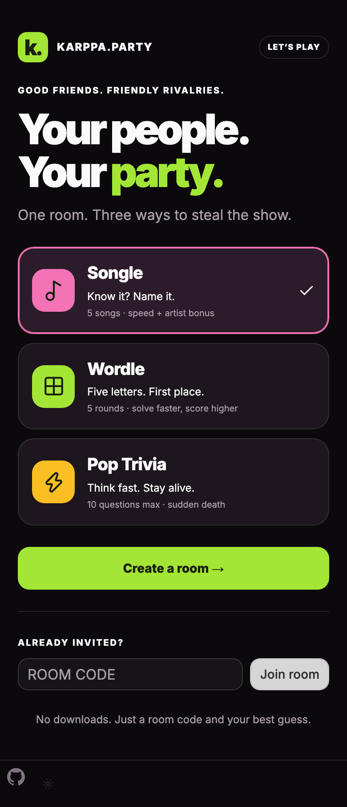
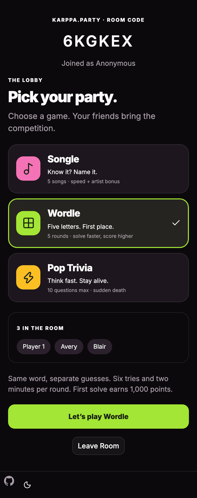
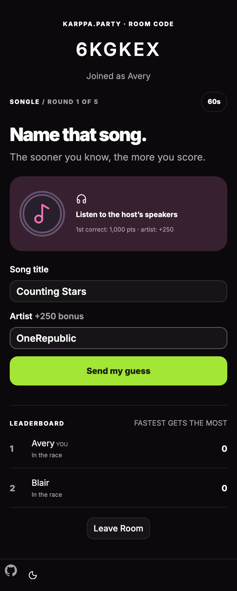
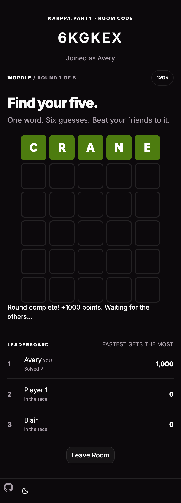
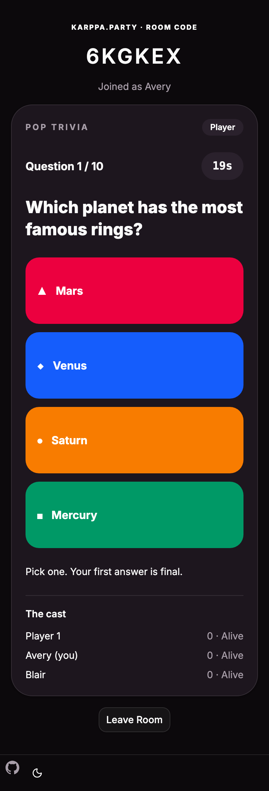
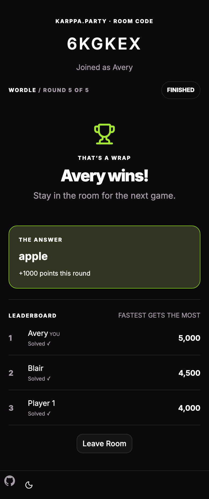

# karppa.party

A mobile-first multiplayer party game. Create a room, share its six-character
code, and pick **Songle**, **Wordle**, or **Pop Trivia**. Everyone plays in their
browser; room state, timers, answers, and scores stay synchronized through Convex.

## The games

| Mode | How it works | Scoring |
| --- | --- | --- |
| **Songle** | Five YouTube songs, in shuffled order. The host is the DJ; players listen through shared speakers and guess the title and artist. Each song has a 60-second guessing window. | First correct title earns 1,000 points, then 900, 800, and so on, with a 100-point minimum. Correct artist adds 250 points, once per song. |
| **Wordle** | Five different words chosen from a curated answer pool. Everyone races on the same word, with six guesses and two minutes per round. Guesses and letter feedback are private. | First solve earns 1,000 points, then 900, 800, and so on, with a 100-point minimum. An unsolved word earns zero. |
| **Pop Trivia** | Up to ten multiple-choice questions. A wrong or missed answer sends you to a sudden-death question. Fail that and you spectate. The remaining players enter a final. | Correct answers earn 1,000 points. The fastest correct answer in the final wins; exact timestamp ties share victory. No correct final answers means no winner. |

Songle and Wordle winners have the highest total after five rounds; equal totals
share the win. Solve order is determined by the server receiving correct answers,
not a player's device clock.

### Hosting Songle

Use one host device with speakers everyone can hear. Tap play in the embedded
YouTube player, wait through any ads, then tap **Start round** when the song is
audible. The host does not compete because YouTube can display the title and artist.
Keep the host screen away from players. If embedding is unavailable, use the
**Open on YouTube** link and start the round once audio is playing there.

This is an in-person listening game, not synchronized audio streaming to every
phone. Playback depends on YouTube availability, region restrictions, browser
permissions, and network access. The app uses a normal visible
[YouTube embed](https://developers.google.com/youtube/player_parameters), without
extracting or downloading audio. The starter pack contains five tracks; edit
`songs` in `convex/partyModel.ts` to change the pack and accepted artist aliases.

### Rooms and rounds

- The host chooses the mode and starts rounds. Anyone with the room code can join.
- The roster locks at game start. New arrivals spectate until the next game.
- Returning in the same browser restores your place, score, and submitted guesses,
  even after leaving and rejoining. Clearing cookies creates a new identity.
- Trivia reveals when everyone eligible answers or time expires. Wordle reveals
  when every player has solved or exhausted their six guesses, or time expires.
  Songle reveals when all players have both title and artist, or time expires.
- Timers run on the server, even if the host disconnects. The host starts the next
  round after the reveal. Rejoin as the same host to continue.
- **Play again** resets scores and admits everyone currently in the room.
  **Choose another game** returns the room to the mode picker.
- Rooms support 100 members at game start and expire after six hours.

## Mobile screenshots

Actual 390px-wide browser captures of the app, stored in `assets/screenshots`.

<p>
  
  
</p>
<p>
  
  
  
</p>
<p>
  
</p>

## Run locally

Requires Node.js 22.18+ and pnpm.

```sh
pnpm install
pnpm exec convex dev
```

Follow Convex's setup instructions for your own development deployment. It writes
`.env.local` with `CONVEX_DEPLOYMENT` and `VITE_CONVEX_URL`. Keep it out of source
control. In another terminal:

```sh
pnpm dev
```

Open the local URL printed by Vite (port 3000 by default). For separate players,
use separate browser profiles or devices; tabs in the same profile share the
anonymous cookie. To test on phones on your LAN, run `pnpm dev --host 0.0.0.0` and
open your computer's LAN address on port 3000.

## Verify

```sh
pnpm test
pnpm build
pnpm exec tsc --noEmit -p convex/tsconfig.json
pnpm lint
```

Backend tests use `convex-test` and fake timers to exercise all modes, complete
five-round games, ranking, artist bonuses, duplicate-letter handling, private
guesses, spectators, rejoining, replay, stale requests, and host-only controls.

With Vite running and the functions pushed to your **development** deployment:

```sh
pnpm exec playwright install chromium
node scripts/mobile-smoke.mjs
node scripts/multiplayer-smoke.mjs
```

The browser smoke tests create disposable dev rooms, run three independent mobile
browser sessions, and regenerate the screenshots. `APP_URL` can override the
multiplayer test's frontend URL. YouTube playback itself may require a manual tap;
the multiplayer test checks the five embed IDs and gameplay, not audio output.

## Project structure

- `src/routes/game-menu/` — main menu, room lobby, mode picker, trivia, and race UI.
- `convex/rooms.ts` — anonymous room creation, joining, leaving, and expiry cleanup.
- `convex/games.ts` — Songle/Wordle mutations, safe player views, and scheduled timers.
- `convex/partyModel.ts` — modes, song pack, Wordle answers, scoring, and feedback.
- `convex/quiz.ts` and `convex/quizModel.ts` — trivia and sudden-death rules.
- `convex/schema.ts` — room and membership storage, with bounded game rosters.
- `assets/` — screenshots and third-party word-list license.

React + TypeScript + Vite power the client. Convex provides persistence and
reactive multiplayer updates. Tailwind and the existing UI components handle
styling. The implementation keeps the two race games together and preserves the
separate trivia engine; there is no speculative game plugin framework.

The prototype uses anonymous browser-cookie identities, not authenticated user
accounts. It is intended for casual games among friends, not adversarial ranked
competition. Wordle guesses use the five-letter subset of `word-list`; regenerate
it with `node scripts/generate-word-list.mjs`. Attribution is in
`assets/word-list-LICENSE.txt`.
